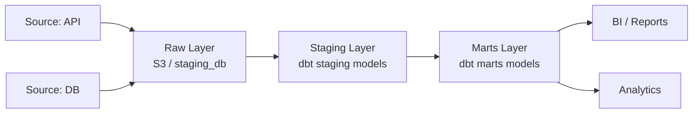

# Data Pipeline — Design & Implémentation

Pipeline de données pour : **$ARGUMENTS**

`$ARGUMENTS` doit décrire le pipeline : source(s), destination, transformation attendue, fréquence.
Exemple : "Pipeline ELT des logs applicatifs vers le data warehouse pour le reporting" ou "Ingestion des données Stripe vers PostgreSQL + agrégations dbt"

## Phase 0 — Qualification

Identifier :
- **Sources** : API externe / DB transactionnelle / Fichiers / Streams (Kafka/Kinesis) ?
- **Destination** : Data warehouse (BigQuery/Redshift/Snowflake) / PostgreSQL / S3 ?
- **Volume** : Ko/jour → Go/jour → To/jour → impact sur la stratégie (batch vs stream)
- **Fréquence** : Temps réel / Horaire / Quotidien / Hebdomadaire
- **Qualité critique** : Finance (exactitude absolue) / Analytics (approximation acceptable) ?

```bash
# Inspecter les sources existantes si locales
ls -la data/ 2>/dev/null || echo "Pas de dossier data/"
find . -name "*.csv" -o -name "*.parquet" 2>/dev/null | head -10

# Vérifier les outils dispo
which dbt python3 airflow psql 2>/dev/null
python3 -c "import pandas, sqlalchemy, pydantic; print('deps OK')" 2>/dev/null || echo "Dépendances Python à installer"
```

## Phase 1 — Architecture du pipeline (lancer avec Task)

### `data-scientist agent`
**Skills activées : data-engineering, database-patterns, async-patterns, testing-patterns**

Concevoir le pipeline de `$ARGUMENTS` :
1. **Architecture ELT** — diagramme Mermaid des flux de données
2. **Modèle de données** — schéma en étoile ou flocon selon les besoins d'analyse
3. **Stratégie d'ingestion** — full load vs incremental (updated_at / CDC)
4. **Transformations dbt** — staging → marts (nommage, tests, documentation)
5. **Politique de rétention** — durée de conservation par couche (raw / staging / marts)

**Diagramme d'architecture à produire :**


### `architect agent`
**Skills activées : database-patterns, api-design, observability-patterns, async-patterns**

- Index et partitioning sur les tables de destination
- Stratégie de déduplication (clés naturelles vs surrogate keys)
- Gestion des late-arriving data
- SLA du pipeline : délai maximum acceptable de fraîcheur des données

### `devops-engineer agent`
**Skills activées : docker-k8s, observability-patterns, incident-response**

- Orchestrateur : Airflow / Prefect / dbt Cloud / cron simple ?
- Infrastructure : Docker Compose local → K8s en prod ?
- Alertes : échec de pipeline → PagerDuty / Slack notification
- Secrets : connexions DB via variables d'environnement / secrets manager

## Phase 2 — Ingestion

### `data-scientist agent` + `developer agent`
**Skills activées : data-engineering, async-patterns, error-handling-patterns**

**Extracteur générique avec retry :**
```python
# src/extractors/base.py
import asyncio
from dataclasses import dataclass
from typing import AsyncIterator
from datetime import datetime

@dataclass
class ExtractionResult:
    source: str
    rows_extracted: int
    started_at: datetime
    finished_at: datetime
    errors: list[str]

async def extract_incremental(
    source_conn: str,
    table: str,
    watermark_col: str,
    last_watermark: datetime,
    batch_size: int = 10_000
) -> AsyncIterator[list[dict]]:
    """Extrait par batch depuis la dernière watermark."""
    # Pattern : utiliser sqlalchemy async + yield par batch
    ...
```

**Chargement avec idempotence :**
```python
# src/loaders/upsert.py
async def upsert_batch(
    records: list[dict],
    target_table: str,
    conflict_keys: list[str]
) -> int:
    """Upsert idempotent — safe à réexécuter."""
    # INSERT ... ON CONFLICT DO UPDATE SET ...
    ...
```

## Phase 3 — Transformations dbt

### `data-scientist agent`
**Skills activées : data-engineering, database-patterns**

**Structure dbt à créer :**
```
models/
├── staging/
│   ├── _sources.yml          # Déclaration des sources
│   ├── stg_$ARGUMENTS.sql    # Nettoyage, renommage, types
│   └── stg_$ARGUMENTS.yml    # Tests + documentation
└── marts/
    ├── dim_*.sql             # Tables de dimensions
    ├── fct_*.sql             # Tables de faits
    └── marts.yml             # Tests + documentation
```

**Modèle staging (template) :**
```sql
-- models/staging/stg_orders.sql
{{ config(
    materialized='incremental',
    unique_key='order_id',
    on_schema_change='append_new_columns'
) }}

WITH source AS (
    SELECT * FROM {{ source('raw', 'orders') }}
    
    WHERE updated_at > (SELECT MAX(updated_at) FROM {{ this }})
    
)

SELECT
    order_id::VARCHAR AS order_id,
    customer_id::VARCHAR AS customer_id,
    amount_cents::INTEGER AS amount_cents,
    amount_cents / 100.0 AS amount_dollars,
    status::VARCHAR AS status,
    LOWER(TRIM(email)) AS email_normalized,
    created_at::TIMESTAMP AS created_at,
    updated_at::TIMESTAMP AS updated_at,
    CURRENT_TIMESTAMP AS _loaded_at
FROM source
WHERE order_id IS NOT NULL  -- Filtre les lignes invalides
```

**Tests dbt obligatoires :**
```yaml
# models/staging/stg_orders.yml
models:
  - name: stg_orders
    description: "Commandes nettoyées depuis la source transactionnelle"
    columns:
      - name: order_id
        tests: [unique, not_null]
      - name: amount_dollars
        tests:
          - not_null
          - dbt_utils.expression_is_true:
              expression: ">= 0"
      - name: status
        tests:
          - accepted_values:
              values: ['pending', 'paid', 'cancelled', 'refunded']
```

## Phase 4 — Qualité des données

### `qa-engineer agent` + `data-scientist agent`
**Skills activées : testing-patterns, data-engineering, error-handling-patterns**

**Checks automatiques à implémenter :**
```python
# src/quality/checks.py
from dataclasses import dataclass
from typing import Callable

@dataclass
class QualityCheck:
    name: str
    query: str
    threshold: float       # Ratio acceptable (0.0 à 1.0)
    severity: str          # "blocking" | "warning"

QUALITY_CHECKS: list[QualityCheck] = [
    QualityCheck(
        name="null_rate_order_id",
        query="SELECT COUNT(*) FILTER (WHERE order_id IS NULL) / COUNT(*)::float FROM stg_orders",
        threshold=0.0,
        severity="blocking"
    ),
    QualityCheck(
        name="duplicate_rate",
        query="SELECT 1 - COUNT(DISTINCT order_id) / COUNT(*)::float FROM stg_orders",
        threshold=0.001,   # Tolérance 0.1%
        severity="blocking"
    ),
    QualityCheck(
        name="freshness_hours",
        query="SELECT EXTRACT(EPOCH FROM (NOW() - MAX(updated_at)))/3600 FROM stg_orders",
        threshold=25.0,    # Max 25h de retard
        severity="warning"
    ),
]
```

## Phase 5 — Orchestration

### `devops-engineer agent`
**Skills activées : docker-k8s, observability-patterns, incident-response**

**DAG Airflow (template) :**
```python
# dags/pipeline_$ARGUMENTS.py
from datetime import datetime, timedelta
from airflow import DAG
from airflow.operators.bash import BashOperator
from airflow.operators.python import PythonOperator
from airflow.utils.task_group import TaskGroup

with DAG(
    dag_id='pipeline_$ARGUMENTS',
    schedule_interval='0 6 * * *',  # Quotidien à 6h UTC
    start_date=datetime(2024, 1, 1),
    catchup=False,
    default_args={
        'retries': 3,
        'retry_delay': timedelta(minutes=5),
        'email_on_failure': True,
    },
    tags=['data-pipeline', '$ARGUMENTS'],
) as dag:

    with TaskGroup("extract_load") as extract_load:
        extract = PythonOperator(task_id='extract', python_callable=run_extraction)
        load = PythonOperator(task_id='load', python_callable=run_loading)
        extract >> load

    with TaskGroup("transform") as transform:
        dbt_staging = BashOperator(task_id='dbt_staging', bash_command='dbt run --select staging')
        dbt_marts = BashOperator(task_id='dbt_marts', bash_command='dbt run --select marts')
        dbt_tests = BashOperator(task_id='dbt_tests', bash_command='dbt test')
        dbt_staging >> dbt_marts >> dbt_tests

    quality_checks = PythonOperator(task_id='quality_checks', python_callable=run_quality_checks)
    notify_success = PythonOperator(task_id='notify_success', python_callable=send_success_notification)

    extract_load >> transform >> quality_checks >> notify_success
```

## Phase 6 — Observabilité du pipeline

### `devops-engineer agent`
**Skills activées : observability-patterns, incident-response**

Métriques à tracker pour chaque run :

```python
# src/monitoring/pipeline_metrics.py
from prometheus_client import Counter, Histogram, Gauge

ROWS_EXTRACTED = Counter('pipeline_rows_extracted_total', 'Rows extracted', ['source', 'table'])
ROWS_LOADED = Counter('pipeline_rows_loaded_total', 'Rows loaded', ['target', 'table'])
PIPELINE_DURATION = Histogram('pipeline_duration_seconds', 'Pipeline duration', ['pipeline'])
DATA_FRESHNESS = Gauge('pipeline_data_freshness_hours', 'Hours since last update', ['table'])
QUALITY_SCORE = Gauge('pipeline_quality_score', 'Data quality score (0-1)', ['table'])
```

**Alertes à configurer :**
- Pipeline failure → notification immédiate (Slack + PagerDuty si P1)
- Data freshness > SLA → alerte warning
- Quality score < 0.99 → alerte blocking
- Volume anomaly (< 50% ou > 200% du volume habituel) → investigation

## Rapport de livraison

```markdown
## Pipeline Livré : $ARGUMENTS

### Architecture
- **Sources** : [liste]
- **Destination** : [data warehouse]
- **Fréquence** : [schedule]
- **Volume estimé** : [X lignes/run]

### Modèles dbt créés
| Modèle | Couche | Rows estimés | Refresh |
|--------|--------|-------------|---------|
| stg_* | Staging | X | Full/Incremental |
| fct_* | Marts | X | Incremental |
| dim_* | Marts | X | Full |

### Qualité
- Checks dbt : X tests
- Quality checks custom : X
- SLA fraîcheur : X heures

### Monitoring
- Dashboard Grafana : [lien]
- Alertes : [X configurées]

### Skills utilisées
- [data-engineering] : modèles dbt, patterns ELT
- [database-patterns] : index, partitioning, upsert
- [observability-patterns] : métriques pipeline, alertes

### Prochaines étapes
1. Backtesting sur données historiques
2. Tuning des thresholds de qualité
3. Documentation des métriques pour les équipes analytics
```
