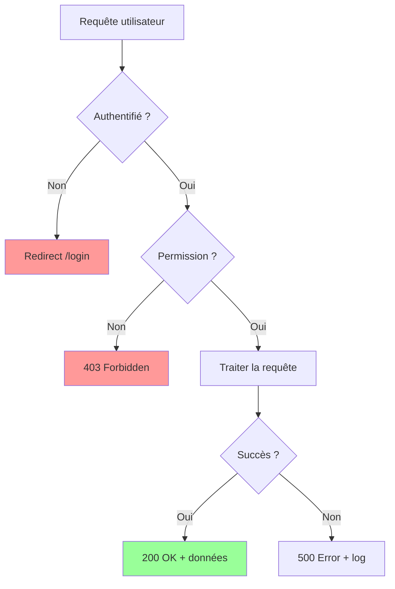
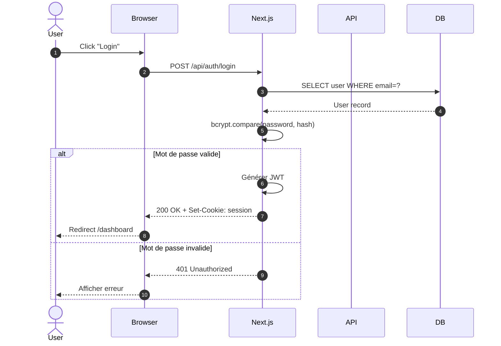
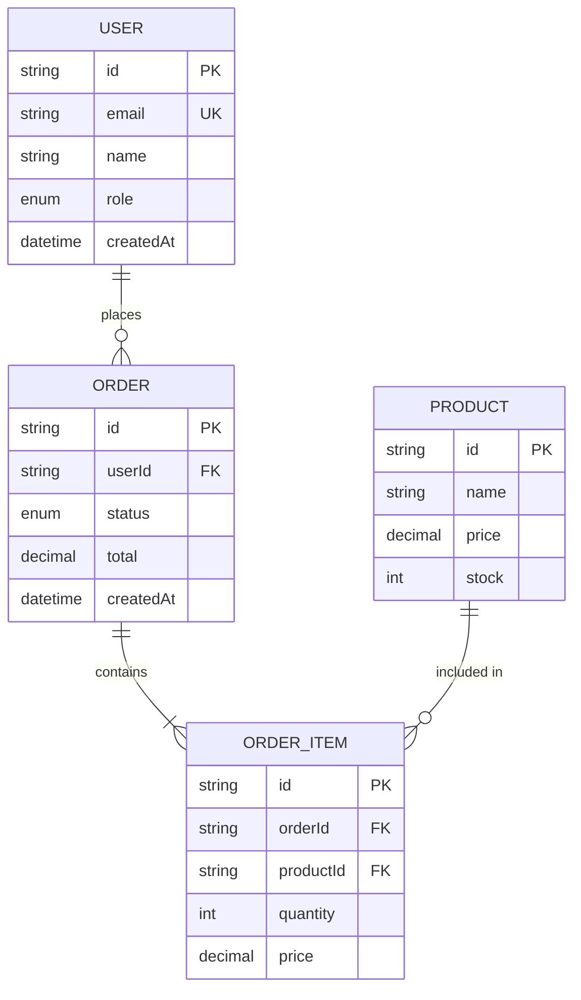
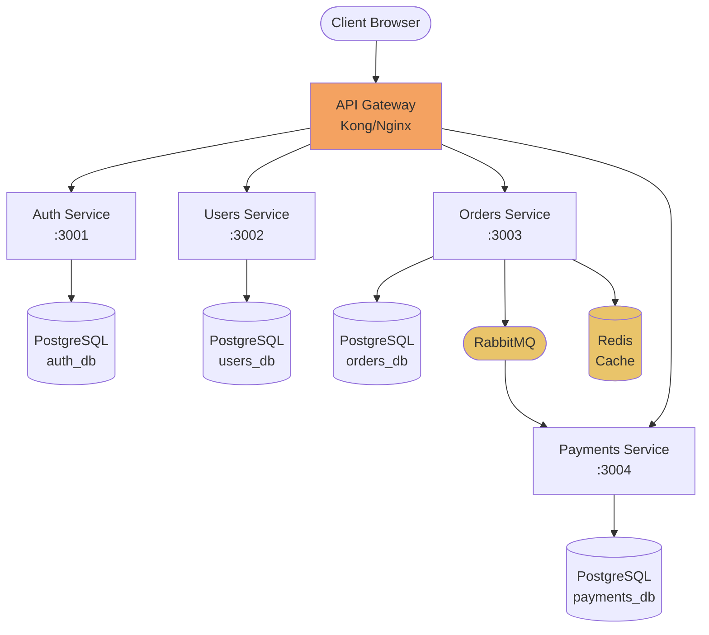
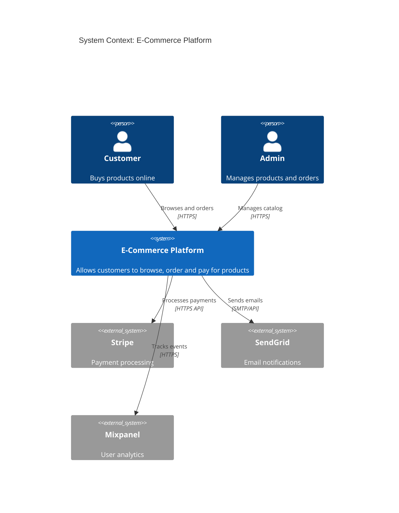
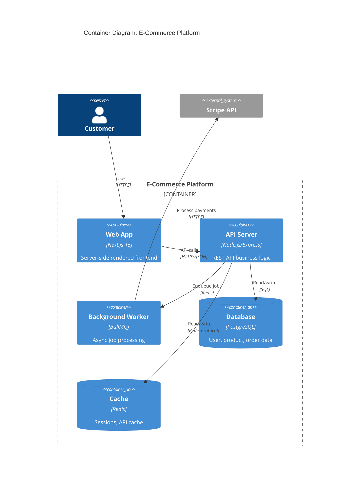
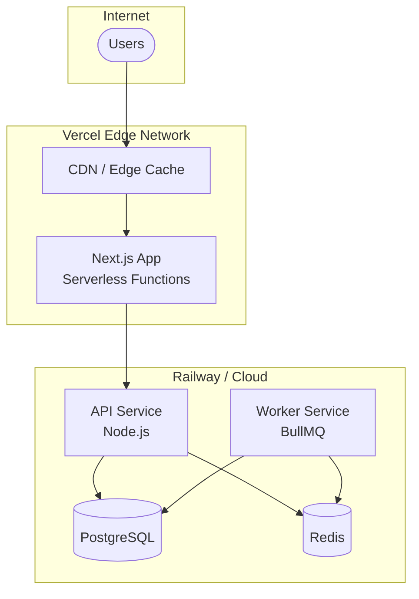

# Architecture Diagrams

## Quand utiliser cette skill

- Documenter une architecture système
- Créer des diagrammes de séquence pour les flux de données
- Visualiser des schémas de base de données
- Représenter des architectures C4 (Context, Container, Component, Code)
- Créer des flowcharts de processus métier

## 1. Mermaid — Syntaxe essentielle

### Flowchart



### Diagramme de séquence



### Diagramme ER (Base de données)



### Architecture de microservices



## 2. Modèle C4 — 4 niveaux

### Niveau 1 : Context (vue d'ensemble)



### Niveau 2 : Container (composants principaux)



## 3. Diagramme de déploiement



## 4. Règles pour des bons diagrammes

```
✅ Titres clairs et descriptifs
✅ Flèches avec labels explicatifs ("Calls", "Reads from", "Publishes to")
✅ Couleurs cohérentes pour les catégories (DB = bleu, service = vert, externe = gris)
✅ Niveau de détail adapté au public (C4 Level 1 pour execs, Level 3 pour devs)
✅ Mettre à jour les diagrammes avec le code (versionner dans /docs/)

❌ Diagrammes avec > 15 éléments sans regroupement
❌ Flèches non labelisées (on ne sait pas ce qui transite)
❌ Mélanger les niveaux d'abstraction (process OS + composant métier ensemble)
❌ Diagrammes non versionnés (obsolètes rapidement)
```

## 5. Générer des diagrammes depuis le code

```typescript
// Générer un diagramme ER depuis le schéma Prisma
import { getDMMF } from '@prisma/internals'

const generateERDiagram = async (schemaPath: string): Promise<string> => {
  const dmmf = await getDMMF({ datamodelPath: schemaPath })

  let mermaid = 'erDiagram\n'
  for (const model of dmmf.datamodel.models) {
    mermaid += `    ${model.name.toUpperCase()} {\n`
    for (const field of model.fields.filter(f => f.kind !== 'object')) {
      mermaid += `        ${field.type} ${field.name}${field.isId ? ' PK' : ''}${field.isUnique ? ' UK' : ''}\n`
    }
    mermaid += '    }\n'
  }
  return mermaid
}
```
